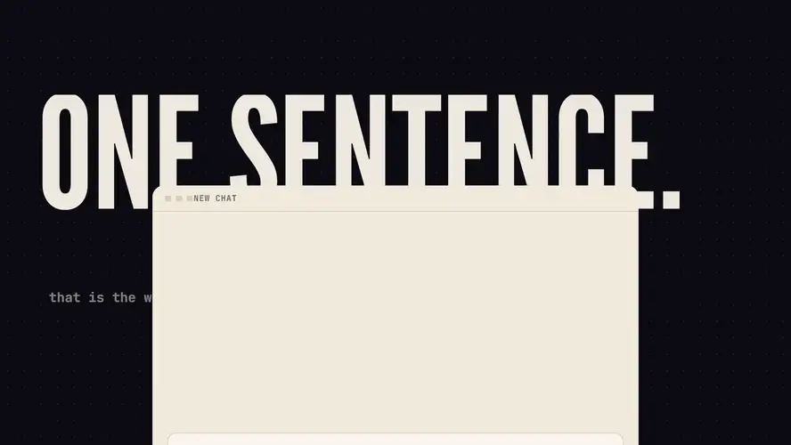
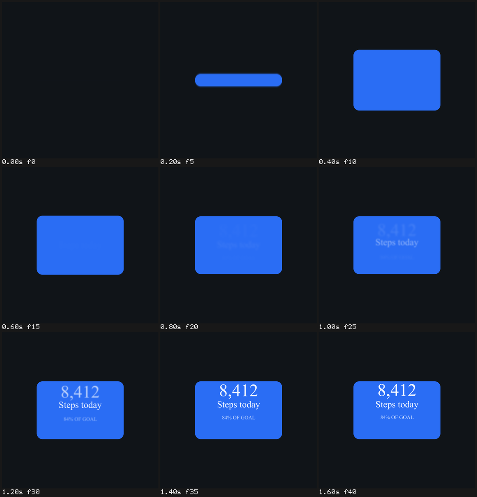
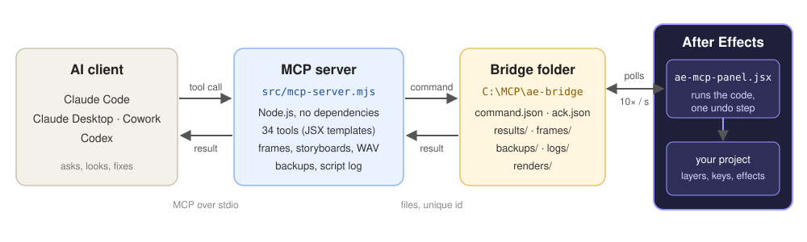

# AE MCP Bridge



**Let Claude (or Codex) work inside Adobe After Effects:** build compositions, shapes, text, effects and animation,
look at the result as frames or a storyboard, and fix it, while you keep a normal, fully editable AE project.

Version 0.3.0 · zero dependencies · Windows and macOS · Claude Code, Claude Desktop, Cowork, Codex

Inspired by **"After Effects MCP by Ruslan Tsapenko"** (v0.1.0) from
[Ruslan Tsapenko](https://www.youtube.com/@RuslanTsapenko) ([tsapenko.com](https://tsapenko.com/)), with tools and
ideas ported from [TheLlamainator/after-effects-mcp](https://github.com/TheLlamainator/after-effects-mcp) (MIT).

[Manual](docs/MANUAL.md) ([PDF](docs/pdf/MANUAL.pdf)) · [Tool reference](docs/TOOLS.md) ([PDF](docs/pdf/TOOLS.pdf)) · [Changelog](CHANGELOG.md)

## Example

> **You:** *"Create a 1080x1080 activity card with the step count and two labels. Animate its entrance in Apple style
> and show me a storyboard."*
>
> **Assistant:** builds the composition and the layers, opens the rounded card through its Rectangle Size with an
> overshoot, brings the texts in with text animators 4 frames apart, turns motion blur on, and checks the motion:



One image, nine frames with time labels: the assistant sees the whole animation at once and catches what a single
frame hides, such as text showing outside a card that is still opening, uneven timing or a missing overshoot.

## What it can do

- **Build:** compositions, text / shape / solid / adjustment / null layers, transforms, parenting, track mattes,
  motion blur, effects with settings, `.ffx` presets, markers, audio levels.
- **Animate:** keyframes with real easing (Easy Ease, ease in/out, custom influence, hold), expressions, text
  animators with a soft per-letter wave, copying animators and effects between layers with a stagger.
- **See:** a frame as an image, a **storyboard** of the animation in one image, side-by-side comparison with a
  reference, MP4 previews, what you selected in AE, the full property tree with keyframes.
- **Script:** run any ExtendScript (`ae_run_jsx`) or your own `.jsx` files; the specialized tools are conveniences
  on top, not a replacement.
- **Stay safe:** every call is one Ctrl+Z, the project is backed up before the first change, scripts are logged,
  arbitrary code can be switched off.
- **Teach good motion:** built-in motion-design guidelines (asymmetric easing, bounce, text animators, stagger,
  track mattes, motion blur, review loop) available as a tool and as MCP prompts, plus an optional Claude skill
  ([`skills/after-effects-motion`](skills/after-effects-motion/SKILL.md)) with the working loop and recipes.

34 tools in total, see the [reference](docs/TOOLS.md).

## Quick start

**With an AI agent:** in Claude Code (or Codex) say *"Install AE MCP Bridge from https://github.com/justajazz/ae-mcp-bridge
into C:\MCP\ae-mcp, following docs/INSTALL-AGENT.md"*. It runs and checks everything and asks you only for
one AE preference and restarting apps. See [INSTALL-AGENT.md](docs/INSTALL-AGENT.md).

**By hand (Windows):**

1. Install [Node.js](https://nodejs.org) LTS and put this repository in a local folder, e.g. `C:\MCP\ae-mcp`.
2. In After Effects enable **Preferences > Scripting & Expressions > Allow Scripts to Write Files and Access Network**.
   Nothing has to be installed or started inside After Effects (an optional status panel exists, see the
   [manual](docs/MANUAL.md#33-optional-the-status-panel)).
3. Connect your client, e.g. Claude Code:
   ```bash
   claude mcp add --scope project after-effects -- node "C:\MCP\ae-mcp\src\mcp-server.mjs"
   ```
   Claude Desktop / Cowork and Codex: see the [manual](docs/MANUAL.md#4-connecting-an-ai-client).
4. Check without any client: `node C:\MCP\ae-mcp\scripts\check-install.mjs` ends with `RESULT: connected`.
5. Ask your assistant: *"Check the connection to After Effects. Don't change anything."*

## How it works



The server is plain Node.js with no packages. For every command it starts a small runner script in the open After
Effects (`AfterFX.exe -s`), which executes the ExtendScript template and writes the result; user data travels
separately from code. Nothing polls inside After Effects, and while a modal dialog is open the command waits for you
to close it instead of breaking the bridge. Requests are synchronous with unique ids, long commands can be
collected later without being run twice. Details: [manual](docs/MANUAL.md#1-how-it-works).

## Development

```bash
npm test
```

runs the protocol, serializer, media and documentation tests against a mock runner, no After Effects needed.
Every tool was also verified against a real After Effects 2026.

## Credits and license

- Inspiration: **Ruslan Tsapenko** and his "After Effects MCP by Ruslan Tsapenko" v0.1.0
  ([YouTube](https://www.youtube.com/@RuslanTsapenko), [tsapenko.com](https://tsapenko.com/)).
- Ported tools and ideas: [TheLlamainator/after-effects-mcp](https://github.com/TheLlamainator/after-effects-mcp),
  based on [Dakkshin/after-effects-mcp](https://github.com/Dakkshin/after-effects-mcp), MIT License © 2025 Dakkshin.
- Made by **Claude Code** & **Yuriy Martyniuk** (assistant, consultant and producer).
- License: [MIT](LICENSE).
