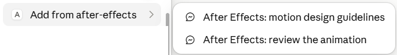
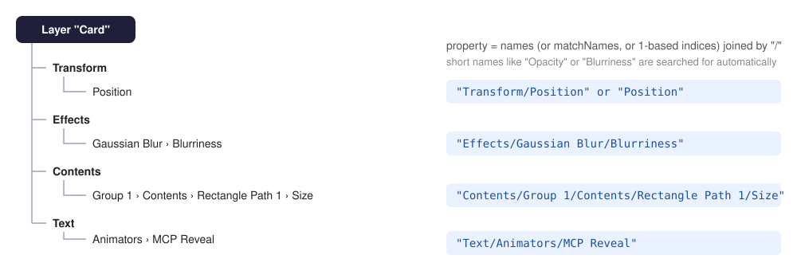

# AE MCP Bridge: user manual

AE MCP Bridge lets an AI assistant (Claude Code, Claude Desktop, Cowork, Codex) work inside Adobe After Effects:
build compositions, layers, effects and animation, look at the result frame by frame, and fix it, while you keep
a normal, editable After Effects project.

It is inspired by **"After Effects MCP by Ruslan Tsapenko"** (v0.1.0, [YouTube @RuslanTsapenko](https://www.youtube.com/@RuslanTsapenko),
[tsapenko.com](https://tsapenko.com/)) and ports tools and ideas from
[TheLlamainator/after-effects-mcp](https://github.com/TheLlamainator/after-effects-mcp) (MIT).

Parameter reference for every tool: [TOOLS.md](TOOLS.md).

## Two ways to install

**Let your AI agent install it.** Start Claude Code (or Codex) in any folder and write:

> Install AE MCP Bridge from https://github.com/justajazz/ae-mcp-bridge into C:\MCP\ae-mcp, following
> docs/INSTALL-AGENT.md in that repository.

If the files are already on your disk: *"Install AE MCP Bridge following C:\MCP\ae-mcp\docs\INSTALL-AGENT.md"*.
The agent follows [INSTALL-AGENT.md](INSTALL-AGENT.md): it runs the commands, checks every step and asks you only
for what it cannot do itself: tick one After Effects preference, approve the server and restart your apps. About five minutes. The chat in Claude Desktop and Cowork cannot do this
(they have no access to your system), but once installed they work with the bridge like any other client.

**Install by hand.** Follow [section 3](#3-installation) and [section 4](#4-connecting-an-ai-client) below.

## Contents

1. [How it works](#1-how-it-works)
2. [Requirements](#2-requirements)
3. [Installation](#3-installation)
4. [Connecting an AI client](#4-connecting-an-ai-client) (and the optional skill)
5. [First steps](#5-first-steps)
6. [Working with the bridge](#6-working-with-the-bridge)
7. [Tools](#7-tools)
8. [Safety: undo, backups, logs](#8-safety-undo-backups-logs)
9. [Configuration](#9-configuration)
10. [Troubleshooting](#10-troubleshooting)
11. [For developers](#11-for-developers)

## 1. How it works


- **`src/mcp-server.mjs`** is the MCP server. The AI client starts it with Node.js; it has no dependencies and needs
  no `npm install` or build step.
- **`src/ae-mcp-runner.jsx`** executes commands inside After Effects. The server copies it into the bridge folder
  and, for every command, starts it in the running After Effects (`AfterFX.exe -s` on Windows, AppleScript
  `DoScriptFile` on macOS). It runs once, writes the result and ends: nothing keeps running in After Effects, so
  nothing needs to be started there.
- **Dialogs.** While a modal dialog is open in After Effects (Composition Settings, Preferences, an error message)
  it refuses every script. The server sees that (on Windows: the main window of After Effects is disabled) and the
  command waits until you close the dialog, up to a minute, instead of failing.
- **`src/ae-mcp-panel.jsx`** is an optional panel that shows the commands as they run. The bridge works without it.
- **The bridge folder** (`C:\MCP\ae-bridge` on Windows, `~/Library/Application Support/ae-mcp-bridge` on macOS) is
  where the two exchange files. It also holds temporary frames, logs, renders and project backups.
- Every request is synchronous and has a unique id, so a slow command is never executed twice.
- Tools are ExtendScript templates kept in the server; your data (names, text, paths) is passed separately and is
  never pasted into code, so quotes or Cyrillic in a layer name cannot break anything.

## 2. Requirements

- **Adobe After Effects** 2023 or newer (tested with After Effects 2026 on Windows 10; macOS paths are supported but
  not tested yet). Track mattes by layer need 2023+.
- **Node.js** 18.17 or newer (LTS recommended): <https://nodejs.org>. Check with `node --version`.
- An MCP client: **Claude Code**, **Claude Desktop** (chat and Cowork) or **Codex**.

## 3. Installation

These are the manual steps. An AI agent can do them for you: see [Two ways to install](#two-ways-to-install).

### 3.1 Get the files

Put the bridge in a permanent local folder, **not** inside Google Drive, OneDrive, Dropbox or iCloud.
Recommended: `C:\MCP\ae-mcp` on Windows, `~/MCP/ae-mcp` on macOS.

```bash
git clone https://github.com/justajazz/ae-mcp-bridge.git C:\MCP\ae-mcp
```

(or download the ZIP and unpack it there). All paths below assume `C:\MCP\ae-mcp`; adjust them if you chose another folder.

### 3.2 Allow scripts in After Effects

After Effects: **Edit > Preferences > Scripting & Expressions** (macOS: *After Effects > Settings*), enable
**Allow Scripts to Write Files and Access Network**, click OK.

That is all After Effects needs: since version 0.3.0 the bridge has no panel to install or start. Open your project
and connect a client ([section 4](#4-connecting-an-ai-client)).

Check the whole chain without any AI client (After Effects must be running):

```bash
node C:\MCP\ae-mcp\scripts\check-install.mjs
```

It starts the server the way a client does, asks After Effects for its status and ends with `RESULT: connected`.

### 3.3 Optional: the status panel

The panel shows a log of the commands the assistant runs (OK / FAIL, duration). It does not take part in the
exchange, so you can close it at any time. Install it with (After Effects may stay open; restart it afterwards):

```bash
node C:\MCP\ae-mcp\src\install-panel.mjs --link
```

- `--link` (recommended) installs a tiny loader into `ScriptUI Panels` that runs the panel from the installation folder.
  After an update of the bridge you only reopen the panel; nothing has to be reinstalled.
- Without `--link` the full panel is copied. Use that if the bridge folder may move; rerun the installer after updates.
- `--uninstall` removes it; `--ae "C:\Program Files\Adobe\Adobe After Effects 2026"` targets one version.
- Writing into `Program Files` needs administrator rights: Windows shows a UAC prompt, confirm it. On macOS the
  `Applications` folder needs `sudo`; pass the full Node path so it is found under sudo as well:
  `sudo "$(which node)" ~/MCP/ae-mcp/src/install-panel.mjs --link`.

Then restart After Effects and open **Window > ae-mcp-panel.jsx**. **Refresh** shows when the last command ran.

> Updating from 0.2: the old panel polled the bridge folder and stopped working (sometimes taking all scripts in
> After Effects down with it) as soon as a modal dialog opened. Reinstall or reopen the panel so the new one
> replaces it; there is no **Start bridge** button any more.

## 4. Connecting an AI client

The server is always started the same way: `node <bridge folder>\src\mcp-server.mjs`. If `node` is not found by
the client, use the full path from `where node` (Windows) or `which node` (macOS), e.g.
`C:\Program Files\nodejs\node.exe`.

### 4.1 Claude Code

Two ways, choose one:

**Option 1: per project (recommended to start with).** In a terminal, inside the folder where you work with Claude:

```bash
claude mcp add --scope project after-effects -- node "C:\MCP\ae-mcp\src\mcp-server.mjs"
```

This creates `.mcp.json` in that folder. The next time you start `claude` there it asks whether to trust the
server: choose **Use this MCP server**. To use the bridge in another project, run the same command there or copy
`.mcp.json` into it (the path inside is absolute, so the file works anywhere).

**Option 2: for all your sessions.**

```bash
claude mcp add --scope user after-effects -- node "C:\MCP\ae-mcp\src\mcp-server.mjs"
```

Trade-offs of option 2: the descriptions of all tools are loaded into every Claude Code session (a few thousand
tokens), an idle server process starts with each session, and After Effects becomes reachable from unrelated
projects. This is not dangerous by itself: Claude Code asks permission for each tool call unless you allow it,
the project is backed up before the first change and every call is one undo step. A middle ground is to keep a
dedicated work folder for After Effects projects with its own `.mcp.json`.

Check with `/mcp` inside Claude Code: `after-effects` should be **connected**.

### 4.2 Claude Desktop (chat) and Cowork

Edit the config file (Claude Desktop: **Settings > Developer > Edit Config**):

- Windows: `%APPDATA%\Claude\claude_desktop_config.json`
- macOS: `~/Library/Application Support/Claude/claude_desktop_config.json`

Add the server inside `mcpServers` (keep everything else in the file unchanged):

```json
{
  "mcpServers": {
    "after-effects": {
      "command": "C:\\Program Files\\nodejs\\node.exe",
      "args": ["C:\\MCP\\ae-mcp\\src\\mcp-server.mjs"]
    }
  }
}
```

Or let the helper do it (it backs the file up and adds only this entry):

```bash
node C:\MCP\ae-mcp\scripts\configure-client.mjs claude-desktop
```

Then **quit Claude Desktop completely** (tray / menu bar icon > Quit; closing the window is not enough) and start it
again. In a chat, the **+ > Connectors** menu lists **after-effects**; Cowork uses the same connectors.
**+ > Connectors > Add from after-effects** offers two ready prompts: *motion design guidelines* and
*review the animation*.



### 4.3 Codex

Add the server in Codex settings (**Settings > MCP**, add a server named `ae_mcp_bridge`, command `node`,
argument: full path to `mcp-server.mjs`) or in `~/.codex/config.toml`:

```toml
[mcp_servers.ae_mcp_bridge]
command = "node"
args = ["C:\\MCP\\ae-mcp\\src\\mcp-server.mjs"]
```

(or run `node C:\MCP\ae-mcp\scripts\configure-client.mjs codex`). Restart Codex completely. Notes for Codex (not tested by us yet):

- All tools work the same way, including frames returned as images.
- Codex may not show MCP prompts; the guidelines are still available through the `ae_guidelines` tool and the short
  version arrives with the server instructions. Ask: *"Read ae_guidelines first."*
- Codex asks permission to run tools; allowing them for the session saves time.

**Already using "After Effects MCP by Ruslan Tsapenko"?** The two bridges can be installed side by side: they use
different bridge folders, so neither sees the other's commands. Their tools, however, have the
same names (`ae_health`, `ae_run_jsx`, ...), which confuses the assistant. While you use this bridge, turn the
original off in **Codex Settings > MCP** (its server is usually named `after_effects`; it stays configured and can be
turned on again) and keep its panel stopped. That is also why this bridge is registered as `ae_mcp_bridge` in Codex.

### 4.4 Optional: the `after-effects-motion` skill (Claude)

`skills/after-effects-motion` is a Claude skill with the working loop (orient, build, check, animate, review with a
storyboard, report), a review checklist and recipes (card with bounce, text wave, counter, track matte, beat markers).
Claude loads it automatically when a task involves After Effects. The motion rules themselves stay in the
`ae_guidelines` tool, so the skill and the server never disagree.

- **Claude Code:** copy the folder to `%USERPROFILE%\.claude\skills\after-effects-motion` (macOS:
  `~/.claude/skills/after-effects-motion`), or to `.claude/skills/` of one project.
- **Claude Desktop / Cowork:** zip the `after-effects-motion` folder and upload it in **Settings > Capabilities > Skills**.

## 5. First steps

With After Effects open:

1. *"Check the connection to After Effects through MCP. Don't change anything."*: the assistant calls `ae_health`
   and reports versions, the open project and the active composition.
2. *"Create a 1080x1080 composition 'Test' with a rounded card and a title in the center, animate their entrance and
   show me a storyboard."*: the assistant builds the scene, animates it and checks the motion with `ae_capture_frames`.
3. Press **Ctrl+Z** in After Effects: each tool call is undone as one step.

## 6. Working with the bridge

### 6.1 The loop

**Ask, then look, then fix.** A good session goes: design the static layout, check it with a frame
(`ae_capture_frame`), agree on it, animate, check the motion with a storyboard (`ae_capture_frames`), refine.
Ask for a storyboard whenever something moves: a single frame cannot show timing problems.


A storyboard like this one shows at a glance what a single frame hides: here the card opens from a line (0.2 s),
overshoots (0.4 s) and settles, the number and the texts appear one after another inside the card, with motion blur.

### 6.2 Useful requests

| Goal | Example request |
|---|---|
| Design from scratch | *"Create an Apple-style activity card 500x800 with rounded corners in a 1080x1080 comp. The step count is the focus."* |
| Recreate a reference | *"Create a 1200x900 comp and rebuild this reference as precisely as possible."* (attach the image; then *"compare it with the reference"* uses `compareWith`) |
| Critique | *"Take a screenshot of the current frame, analyse the design and tell me what to improve. Don't change anything."* |
| Animate | *"Animate this in Apple style: the card opens through its rectangle Size with a small bounce, the texts appear with text animators, 4 frames apart, motion blur on."* |
| Review motion | *"Make a storyboard of 'Intro' and evaluate the animation."* or the *review the animation* prompt |
| Work with what you selected | Select a layer or a text animator in AE, then: *"Analyse the selected animator and apply the same animation to all text layers except the counter, 4 frames apart."* |
| Copy animation | *"Copy the Drop Shadow from Card to Title and Subtitle."* |
| Clip content | *"Make the subtitle visible only inside the card (track matte), keep the card visible."* |
| Music markers | *"Find the beats in the Music layer and put markers on them."* |
| Watch it | *"Render an MP4 preview of the first 3 seconds at half resolution."* |
| Scripts | *"Run C:\MCP\scripts\rename-layers.jsx on the active comp."* |

### 6.3 Tips

- Small position tweaks are often faster by hand in AE; leave structure, repetitive work and analysis to the assistant.
- Before asking for animation, ask the assistant to read the guidelines (`ae_guidelines`) or use the
  *motion design guidelines* prompt: it then avoids opacity-only fades, uses asymmetric easing, text animators,
  stagger, track mattes and motion blur.
- Name your layers; the assistant addresses layers by name.
- Tell the assistant which composition to use if several are open.

## 7. Tools

34 tools. Every parameter is described in [TOOLS.md](TOOLS.md).

Properties are addressed by paths through the layer's property tree:



**Bridge and project**

| Tool | What it does |
|---|---|
| `ae_health` | Versions, whether After Effects runs or shows a dialog, open project, active comp. |
| `ae_guidelines` | Motion-design and workflow guide for the assistant. |
| `ae_list_project` | Compositions with layers, plus folders, footage and solids. |
| `ae_open_project` | Open another .aep (asks to save or discard unsaved changes). |
| `ae_save_project` | Save, or save as. |
| `ae_get_result` | Collect the result of a command that outlived its timeout. |

**Scripting**

| Tool | What it does |
|---|---|
| `ae_run_jsx` | Run any ExtendScript; returns the last value. |
| `ae_run_jsx_file` | Run a .jsx file from disk. |

**Looking at the result**

| Tool | What it does |
|---|---|
| `ae_capture_frame` | One frame as an image (background filled with the comp color; optional reference image beside it). |
| `ae_capture_frames` | Storyboard: several frames in one image with time labels. |
| `ae_render_preview` | MP4 or PNG sequence through the Render Queue. |
| `ae_get_selection` | What you selected in AE, with keyframes and property trees. |
| `ae_inspect` | Full property tree of a layer or group: values, keys, easing, expressions. |

**Compositions and layers**

| Tool | What it does |
|---|---|
| `ae_create_comp` | New composition. |
| `ae_set_comp` | Size, duration, frame rate, background, motion blur, work area, current time. |
| `ae_create_layer` | Text, shape (rectangle, ellipse, polygon, star), solid, adjustment or null layer. |
| `ae_set_layer` | Transform, timing, parent, 3D, label, text style, motion blur, track matte. |
| `ae_center_layers` | Center layers visually (anchor moved to the content center). |
| `ae_get_layer_timing` | In/out points in seconds and frames. |

**Properties and animation**

| Tool | What it does |
|---|---|
| `ae_set_property` | Any property by path, static or at a time. |
| `ae_set_keyframes` | Keyframes with easing (linear, hold, bezier, easy, easyIn, easyOut, custom). |
| `ae_set_expression` | Set or remove an expression; reports expression errors. |
| `ae_add_text_animator` | Text reveal through a text animator (soft wave by characters/words, or by lines). |
| `ae_copy_animation` | Copy animators, effects or properties with keys to other layers, staggered. |

**Effects and presets**

| Tool | What it does |
|---|---|
| `ae_list_available_effects` | Search installed effects. |
| `ae_apply_effect` | Apply an effect by name and set its parameters. |
| `ae_list_layer_effects` | Effects on a layer with their values. |
| `ae_remove_effects` | Remove effects. |
| `ae_list_presets` | Find .ffx animation presets. |
| `ae_apply_preset` | Apply a preset to a layer. |

**Markers and audio**

| Tool | What it does |
|---|---|
| `ae_add_markers` | Layer or composition markers, one or many. |
| `ae_get_audio_info` | Audio source file, levels and markers of a layer. |
| `ae_set_audio_levels` | Audio Levels, static or keyed. |
| `ae_analyze_audio` | Find peaks in a WAV file and optionally place markers on them. |

## 8. Safety: undo, backups, logs

- **Undo.** Every changing tool call is one undo group named `MCP: <tool>`: one Ctrl+Z undoes the whole call.
- **Backups.** Before the first change to a project in a server session, the saved `.aep` is copied to
  `C:\MCP\ae-bridge\backups\<name>_<date>_<time>.aep`; the last 5 per project are kept. The copy is the state of
  the file on disk, so save your project before a session if you want unsaved work included.
- **Logs.** Every executed script is written to `C:\MCP\ae-bridge\logs\ae-mcp-<date>.log` (kept 30 days).
- **No arbitrary code mode.** Set `AE_MCP_DISABLE_RUN_JSX=1` for the server: `ae_run_jsx` and `ae_run_jsx_file`
  disappear and only the built-in tools remain.
- **Permissions.** Claude and Codex ask before each tool call until you allow a tool permanently. `ae_run_jsx` can
  do anything a script can do in After Effects, including reading and writing files; keep that in mind before
  allowing it without prompts.
- Work on copies of important projects when you experiment.

## 9. Configuration

Environment variables of the **server** (set them in the client config: `env` in `.mcp.json` /
`claude_desktop_config.json`, or `env` in Codex):

| Variable | Default | Meaning |
|---|---|---|
| `AE_MCP_BRIDGE_DIR` | `C:\MCP\ae-bridge` / `~/Library/Application Support/ae-mcp-bridge` | Bridge folder. If you change it, set the same variable for After Effects too (see below). |
| `AE_MCP_TIMEOUT_MS` | `30000` | How long a tool waits before returning a `commandId` (renders and frames wait longer). |
| `AE_MCP_PICKUP_TIMEOUT_MS` | `10000` | How long to wait for After Effects to start a command before reporting it did not. |
| `AE_MCP_DIALOG_WAIT_MS` | `60000` | How long a command waits for you to close a modal dialog in After Effects. |
| `AE_MCP_RETRIGGER_MS` | `4000` | Re-send the start signal if After Effects has not started the command after this long. |
| `AE_MCP_AFTERFX` | found automatically | Full path to `AfterFX.exe` (macOS: the After Effects `.app`), if detection fails. |
| `AE_MCP_DISABLE_RUN_JSX` | off | `1` disables `ae_run_jsx` and `ae_run_jsx_file`. |
| `AE_MCP_BACKUP` | on | `0` disables project backups. |
| `AE_MCP_BACKUP_KEEP` | `5` | Backups kept per project. |
| `AE_MCP_BACKUP_DIR` | `<bridge>\backups` | Backup folder. |
| `AE_MCP_LOG` | on | `0` disables the script log. |
| `AE_MCP_LOG_DAYS` | `30` | Days to keep logs. |

The runner finds the bridge folder by itself (it runs from there). Only the optional panel reads
`AE_MCP_BRIDGE_DIR` from the environment of After Effects: set it as a user variable
(`setx AE_MCP_BRIDGE_DIR "D:\my-bridge"`) and restart After Effects if you moved the folder and use the panel. Keep the bridge folder out
of cloud-synced folders: sync clients lock files, and the server warns about it.

Example `.mcp.json` entry with options:

```json
{
  "mcpServers": {
    "after-effects": {
      "command": "node",
      "args": ["C:\\MCP\\ae-mcp\\src\\mcp-server.mjs"],
      "env": { "AE_MCP_BACKUP_KEEP": "10", "AE_MCP_TIMEOUT_MS": "60000" }
    }
  }
}
```

## 10. Troubleshooting

Start with `node C:\MCP\ae-mcp\scripts\check-install.mjs`: it tests the server and After Effects without any client and
tells you which side is missing.

| Symptom | What to do |
|---|---|
| *"After Effects is not running"* | Start After Effects and open the project. The bridge never starts After Effects by itself. |
| *"A dialog is open in After Effects"* | Close the dialog named in the message (Composition Settings, Preferences, an error). The command waited for it and was not executed; ask again. |
| *"did not start the command"* | After Effects is busy (rendering, loading a project) or scripts are blocked: enable **Allow Scripts to Write Files and Access Network**. Nothing was executed. `<bridge>/logs/runner-*.log` lists runner errors. |
| AE shows *"Cannot run a script while a modal dialog is waiting for response"* | A dialog opened in the same second a command was sent. Click OK and close the dialog: the server sends the command again, and it runs once. |
| A tool returns `status: running` | The command is still running in AE. Ask the assistant to wait for it (`ae_get_result`); do not repeat the request. |
| *"After Effects is still executing ..."* | A previous long command is running; wait for it. |
| *Undo group mismatch* dialog in AE | Click OK. It appears when a project is opened or closed inside a script; use `ae_open_project` instead. |
| *Unable to write file* / nothing happens | Enable **Allow Scripts to Write Files and Access Network** in AE preferences. |
| The optional panel is not in the **Window** menu | Restart After Effects after installing; check that the installer wrote to the right AE version. |
| *Version mismatch* warning in `ae_health` | Restart the AI client: the server reinstalls `<bridge>/runner.jsx` when it starts. |
| The client does not list the tools | Check the command and the path to `mcp-server.mjs`; use the full path to `node`; restart the client completely; in Claude Code check `/mcp`. |
| Cloud-sync warning | Move the bridge folder out of OneDrive / Google Drive / Dropbox / iCloud. |
| Text looks wrong in the frame | Fonts are referenced by PostScript name (e.g. `Arial-BoldMT`); a missing font falls back silently. |

## 11. For developers

- `npm test`: protocol, serializer, PNG/WAV and documentation tests against a Node mock of the runner and a fake After Effects launcher (no AE needed).
- `npm run test:live`: the same checks against a real After Effects 2026 with a dedicated test project; `--dialog`
  adds the modal-dialog scenario (open and close Composition Settings when asked).
- `node scripts/gen-tools-doc.mjs` regenerates [TOOLS.md](TOOLS.md) after changing tool definitions.
- `scripts/check-install.mjs` and `scripts/configure-client.mjs` are the installation helpers used by
  [INSTALL-AGENT.md](INSTALL-AGENT.md).
- Architecture: tools are ES3 JSX templates in `src/jsx.mjs` with a shared one-line `lib` prepended; user data goes
  in `args`. Media processing (PNG compositing, contact sheets, WAV analysis, preset search) is in `src/media.mjs`.
  The runner (`src/ae-mcp-runner.jsx`) only evaluates code, manages undo groups and serializes results safely;
  `src/ae-launch.mjs` starts it in After Effects and `src/win-probe.ps1` detects modal dialogs on Windows.
  Nothing in After Effects uses `app.scheduleTask`: in After Effects 2026 a scheduled task that meets a modal dialog
  leaves the scripting engine refusing every script until After Effects is restarted.
- ExtendScript is ES3: no `let`/`const`, arrow functions, template literals, `Array.forEach/map/indexOf`;
  `tests/panel.test.mjs` lints the runner, the panel and every template.

## Credits

- Inspiration: **Ruslan Tsapenko** and his "After Effects MCP by Ruslan Tsapenko" v0.1.0.
- Tools and ideas ported from [TheLlamainator/after-effects-mcp](https://github.com/TheLlamainator/after-effects-mcp),
  based on [Dakkshin/after-effects-mcp](https://github.com/Dakkshin/after-effects-mcp) (MIT, © 2025 Dakkshin).
- Made by **Claude Code** & **Yuriy Martyniuk** (assistant, consultant and producer).
- License: MIT.
